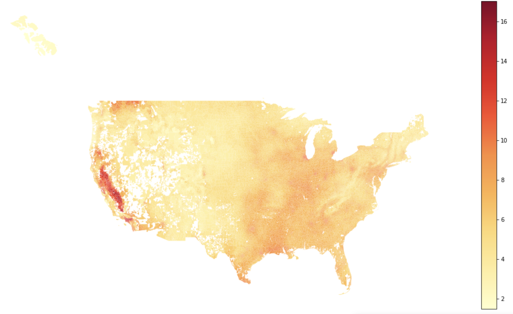

# netcdf_aggregator
Process and aggregate netcdf exposures data from [Randall Martin's data](https://sites.wustl.edu/acag/datasets/surface-pm2-5/). We use [downscale](https://en.wikipedia.org/wiki/Downscaling) rasterization strategy and [TIGER/ Lines Shapefiles](https://www.census.gov/geographies/mapping-files/time-series/geo/tiger-line-file.2000.html#list-tab-790442341). 

The pipeline to do the rasterization and aggregation can be found here:
 https://github.com/NSAPH-Data-Platform/nsaph-gis/blob/develop/nsaph_gis/

Example result: 
| PM25 | zcta | Year |
| :---         |     :---:      |          ---: |
| 6.678696   | 43451     | 2018    |
| 7.124078     | 43452       | 2018      |

### The notebook file contains the basic exploration for Netcdf data and EDA for rasterization result. 

Here is the example of coverage map for year 2018: 

